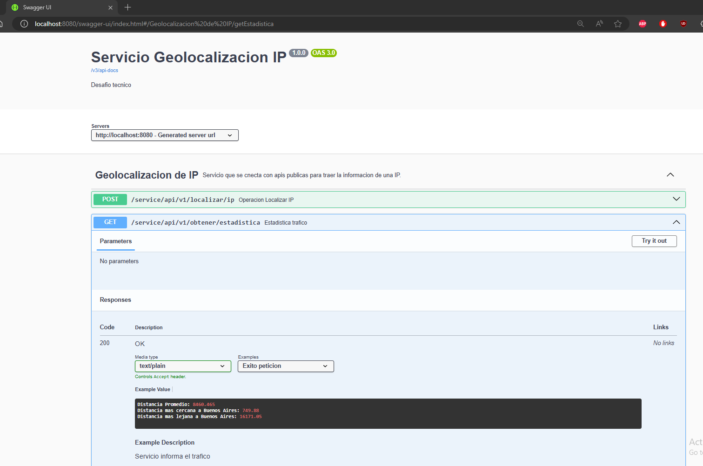
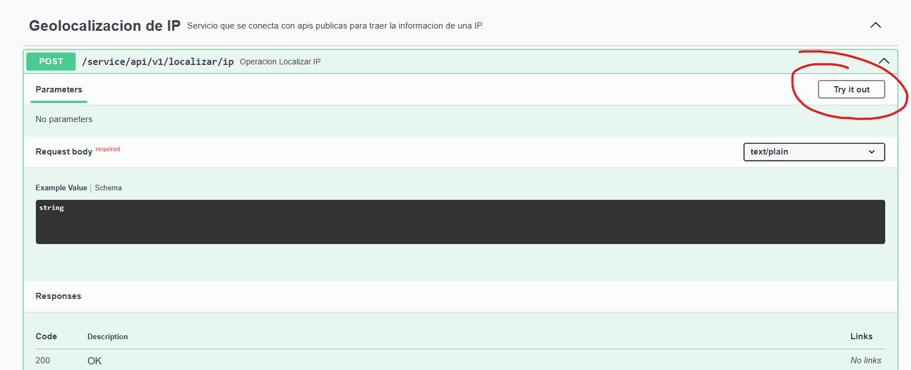
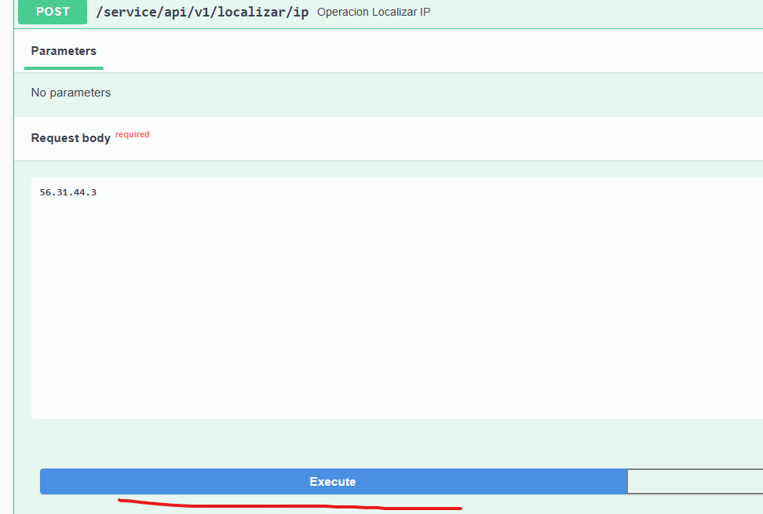
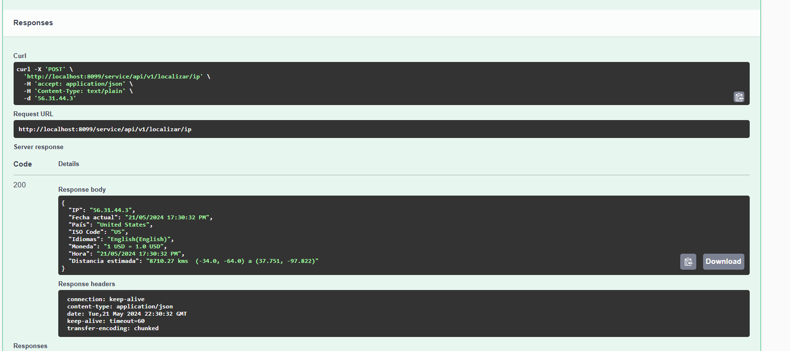
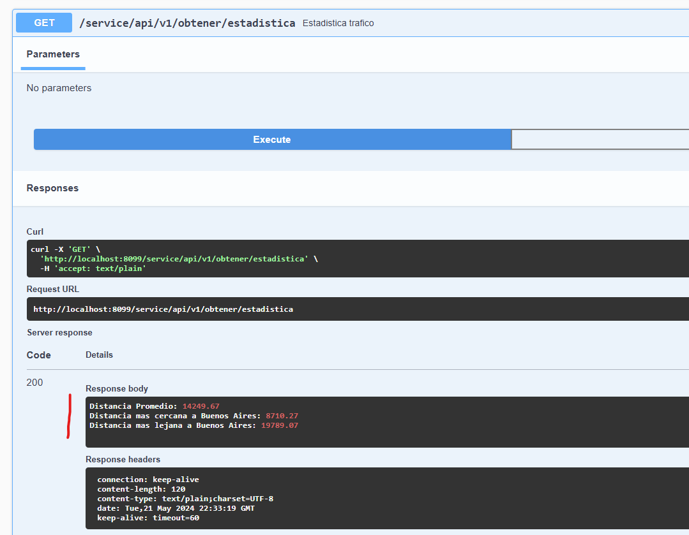
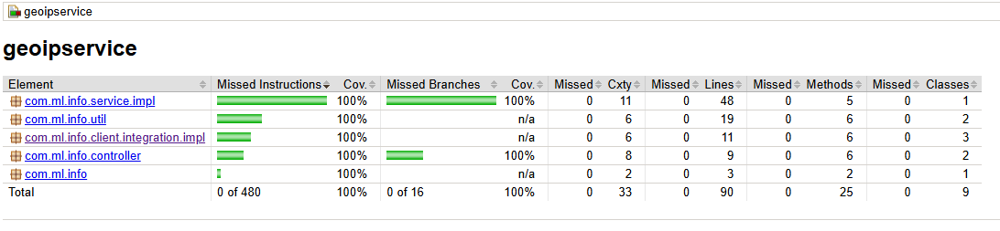
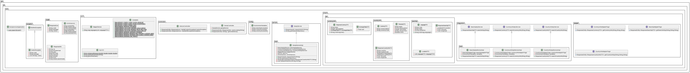
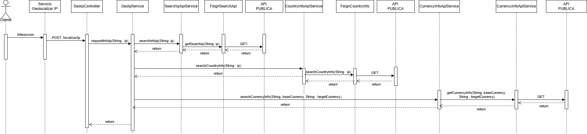

# Desafio Tecnico.

GeoIpService

# Prerequisitos

Ambiente de desarrollo:
- Apache maven 3.8.x o superior
- Editor de codigo de preferencia(ej. Intellij Community)
- Java 17
- Docker

# Generalidades

El proposito del servicio es reunir informacion de una ip suministrada, para coordinar acciones en respuesta ante fraudes.

Se conecta con varias apis publicas para generar una estructura que ayude a identificar el comportamiento de una ip(Pais, fecha de ejecucion, fecha del pais, etc..)

El servicio tambien expone una operacion para las estadisticas:

    - Distancia mas lejana a Buenos Aires
    - Distancia mas cercana a Buenos Aires
    - Distancia promedio con todas las ejecuciones

### Observaciones a tener en cuenta

Algunas de las Apis publicas utilizadas en este servicio son diferentes a las inicialmente recomendadas en el ejercicio, esto debido a que hubo tema de costos que no se abordaron y se busco otras alternativas; como Apis que tuvieran mas informacion y sin ningun costo.

La cantidad de peticiones que pueden ser lanzadas a este servicio es limitada, debido a que las Apis publicas limitan la cantidad de peticiones que pueden ser lanzadas al mismo tiempo, para temas de concurrencia es mejor pensar en apis que no tengan dicha restriccion, adicional que el autoescalamiento del servicio debe implementarse en la nube adecuada y con las configuraciones debidas.

Dependiendo el punto donde se encuentre esta operacion en la arquitectura, es posible pasar a un enfoque netamente reactivo y concurrente, no se hizo ese alcanze ya que las condiciones para probar estos escenarios son limitadas como ya lo he mencionado.

### Despliegue continuo y dockerizacion

El repositorio esta enlazado con la herramienta gratuita de **Circle CI** para verificar la compilacion del proyecto.

El servicio tambien fue subido y esta disponible en dockerhub

[Docker](https://hub.docker.com/r/wasawsky/geoipservice)

Para descargar se puede con el comando de docker

    docker pull wasawsky/geoipservice

Tambien se puede recompilar usando los comandos, en la raiz de este repositorio

    mvn clean package

    docker build -t geoipservice:latest .

Para correr la imagen del docker es el siguiente comando

    docker run -p 8099:8080 geoipservice:latest

### Consumo del servicio

Siguiendo los pasos anteriores el servicio se puede consumir via Swagger o directamente con peticiones Curl o desde postman
    
    curl --location 'localhost:8099/service/api/v1/localizar/ip' \
    --header 'Content-Type: text/plain' \
    --data '55.176.130.0'

El acceso al Swagger puede ser desde el navegador indicando el puerto asignado en docker

    http://localhost:8099/swagger-ui/index.html#/Geolocalizacion%20de%20IP/postLocateIp

# Informacion del servicio

### Swagger del servicio

El servicio esta desarrollado con la dependencia de OpenApi Springboot para generar el contrato swagger en el mismo.

 
Para ejecutar la operacion de localizar la ip es necesario abrir las opciones que aparecen y continuar con el intento

Aparecera un campo donde se puede poner la informacion a enviar

Despues de ejecutar el servicio respondera con la informacion de la ip

Finalmente, tambien esta la operacion de consulta del trafico del servicio que nos expone la informacion que necesitamos conocer

### Reporte cobertura Jacoco

La cobertura de las clases del servicio esta cubierta y se exceptuaron unicamente clases de configuracion y DTO's

### Estructura integracion del servicio

Para este entregable, esta es la estructura actual de este desarrollo.

### Diagrama de clases

Diagrama de clases del desarrollo

### Diagrama de secuencia del servicio

Diagrama de clases del desarrollo

## BIBLIOGRAFIA:

[SpringBoot](https://spring.io/projects/spring-boot)

[Java](https://www.java.com/es/)

*Por: Michael Ballesteros*
