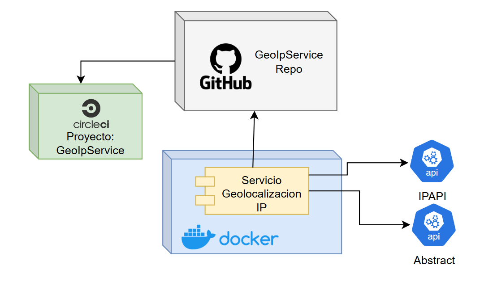

# Desafio Tecnico.

GeoIpService

# Prerequisitos

Ambiente de desarrollo:
- Apache maven 3.8.x o superior
- Editor de codigo de preferencia(ej. Intellij Community)
- Java 17

# Generalidades

El proposito del servicio es reunir informacion de una ip suministrada, para coordinar acciones en respuesta ante fraudes.

Se conecta con varias apis publicas para generar una estructura que ayude a identificar el comportamiento de una ip(Pais, fecha de ejecucion, fecha del pais, etc..)

El servicio tambien expone una operacion para las estadisticas:

    - Distancia mas lejana a Buenos Aires
    - Distancian mas cercana a Buenos Aires
    - Distancia promedio con todas las ejecuciones

El servicio esta conectado con la herramienta gratuita de Circle CI para verificar la compilacion del proyecto

## Consumo del servicio

# Informacion del servicio

### Swagger del servicio

### Reporte cobertura Jacoco

### Estructura integracion del servicio

### Diagrama de clases

## BIBLIOGRAFIA:

[SpringBoot](https://spring.io/projects/spring-boot)

[Java](https://www.java.com/es/)

*Por: Michael Ballesteros*
